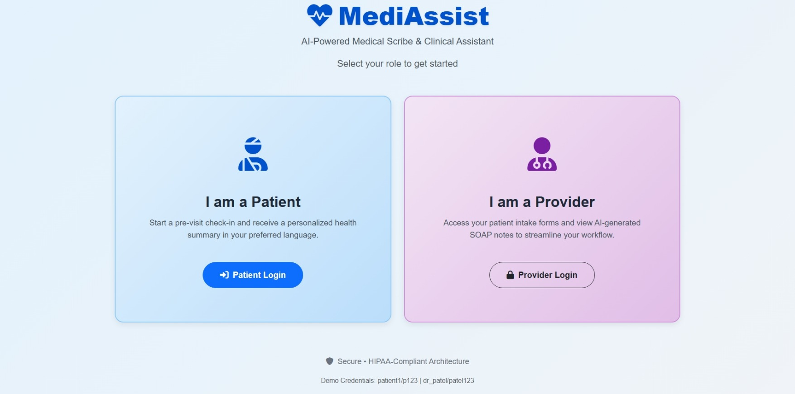
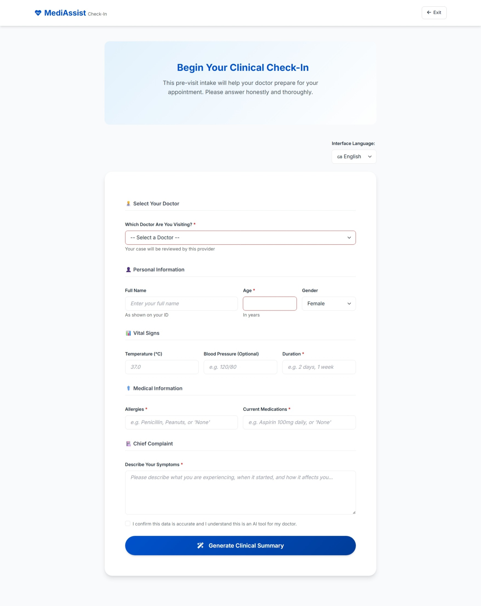
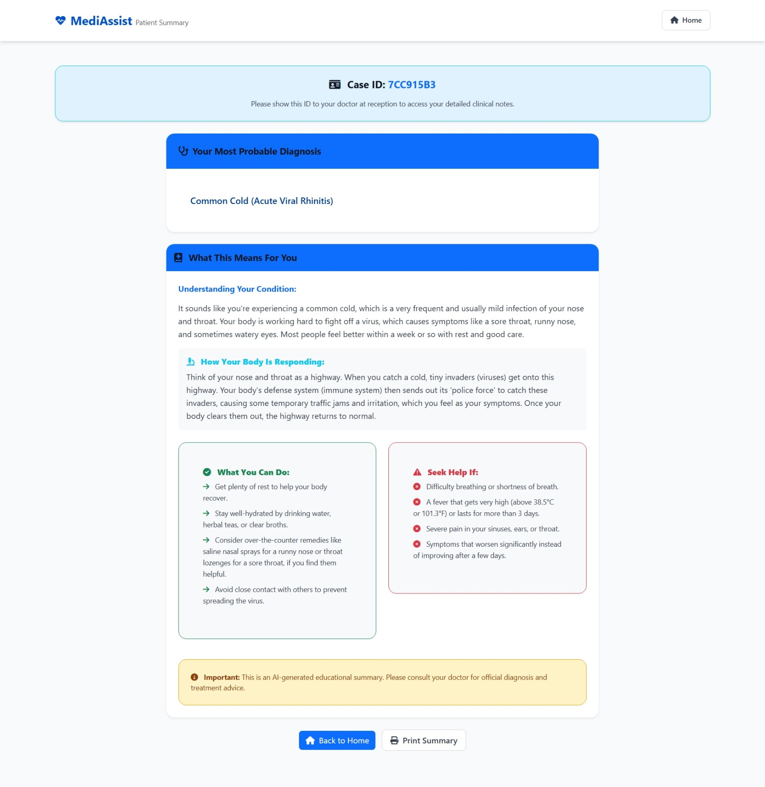
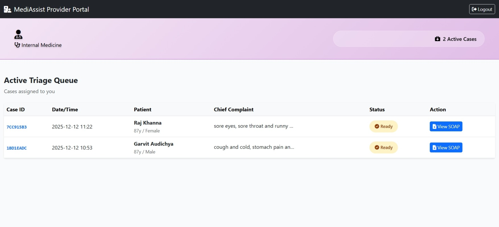
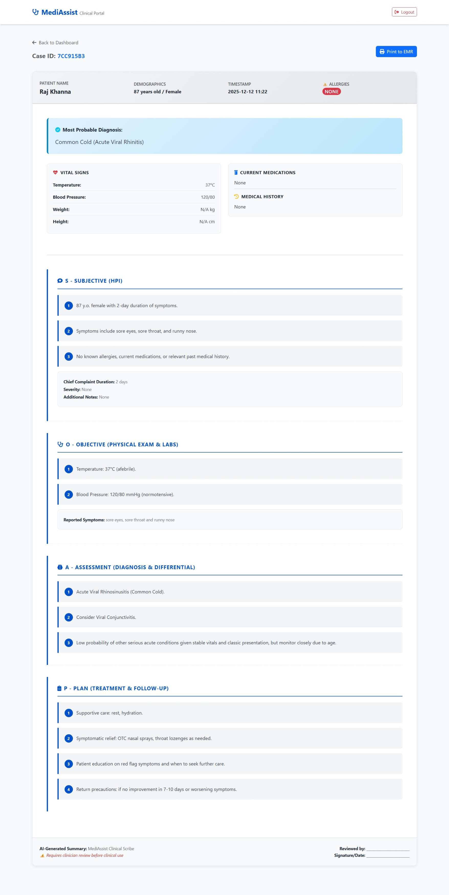

---

# 🏥 MediAssist — AI-Powered Clinical Scribe & Patient Communication System

**🔗 Live Demo:** https://drive.google.com/file/d/1OhT6f8fyNhImuS_XcwlQSJv5BnP6Ubje/view?usp=sharing

MediAssist is a full-stack, role-based medical documentation system that converts raw patient symptoms into **dual-purpose clinical intelligence**.
Using **Google Gemini**, it produces:

1. **Empathetic, localized patient summaries** (Hindi/English)
2. **Structured clinical SOAP notes** for physicians

This system bridges the communication gap between patients and doctors while preserving clinical accuracy, trust, and documentation efficiency.

---

## ❗ The Core Problem

Modern healthcare suffers from **documentation overload**. Physicians spend a significant portion of their day typing clinical notes, decreasing face-to-face time with patients. Meanwhile, patients may struggle to understand overly technical medical wording, especially in multilingual environments.

**Challenge:**
How do we augment clinical workflows with AI **without reducing patient trust or compromising medical accuracy**?

---

## 🚀 MediAssist — Engineering-Driven Solution

MediAssist introduces a **Dual-Agent Scribe Architecture**:

### 🔹 1. Dual-View Generation

Gemini generates *two* synchronized outputs:

* **Patient View:** Plain-language summary (Hindi/English)
* **Doctor View:** Structured SOAP note (English only)

### 🔹 2. Persistent Case Storage (Local MLOps)

The system uses simple but effective CSV “databases”:

* `users.csv` — Auth + RBAC
* `cases.csv` — Case metadata + AI outputs

### 🔹 3. Strict JSON Medical Prompting

The AI always returns:

* Deterministic structured JSON
* SOAP components
* Safety fields
* Language-specific responses

### 🔹 4. Role-Based Access Control (RBAC)

* Patients can only submit cases
* Doctors only view cases assigned to them
* Protected Flask sessions maintain identity

### 🔹 5. Multi-Language Communication (i18n)

Supports:

* **Hindi**
* **English**

For culturally contextual patient communication.

---

# 🧩 System Architecture Overview

```
Patient Intake → JSON Prompt → Gemini Model → AI Dual Output
       ↓                                   ↓
   Raw Data Saved                    SOAP Note + Summary
       ↓                                   ↓
 CSV Persistence                   Doctor Dashboard View
```

Core elements:

* Flask backend
* Gemini 2.5 Flash model
* Case logging (`clinical_logs.csv`)
* Secure password hashing
* UUID case identifiers

---

# 🛠️ Features (Engineering Breakdown)

| Feature                       | Description                        | Tech Keywords                             |
| ----------------------------- | ---------------------------------- | ----------------------------------------- |
| **Dual-Language Scribing**    | Patient summary + Doctor SOAP note | Prompt Engineering, NLP, Agentic Workflow |
| **CSV-Based Local DB**        | Persistent local storage           | MLOps Lite, Logging                       |
| **RBAC System**               | Doctor/Patient access separation   | Flask Auth, Secure Sessions               |
| **Case History & Versioning** | Reproducible AI outputs            | Audit Trails                              |
| **Localization**              | Hindi/English                      | i18n, UX                                  |
| **Fully Structured Output**   | Deterministic JSON                 | Structure Enforcement                     |

---

# ▶️ Running the Project Locally

## **1. Prerequisites**

* Python 3.9+
* Gemini API Key

---

## **2. Installation**

```bash
git clone https://github.com/garvit-010/MediAssist_AI_Powered_Scribe.git
cd MediAssist
```

Create environment:

```bash
python -m venv venv
source venv/bin/activate     # Mac/Linux
venv\Scripts\activate        # Windows
```

Install dependencies:

```bash
pip install -r requirements.txt
```

---

## **3. Environment Setup**

Add a `.env` file:

```
GEMINI_API_KEY="YOUR_KEY"
FLASK_SECRET_KEY="ANY_RANDOM_SECURE_KEY"
```

---

## **4. Initialize Data**

```bash
python app.py
```

Demo credentials:

| Role    | Username | Password |
| ------- | -------- | -------- |
| Patient | patient1 | p123     |
| Doctor  | dr_smith | smith123 |
| Doctor  | dr_patel | patel123 |

---

# 🧪 Demo Workflow

### **1. Patient Login**

Go to `/patient/login` → login as **patient1 / p123**

### **2. Submit Symptoms**

Fill patient details and select a doctor.

### **3. AI Processing**

System generates:

* Patient summary
* Doctor SOAP note

### **4. Doctor Review**

Login as **dr_patel / patel123**
View the case in the doctor dashboard.

---

# 📸 UI Previews

### **🖼️ Login Page**



---

### **🖼️ Intake / Registration Form**



---

### **🖼️ AI-Generated Summary (Patient View)**



---


### **🖼️ Doctor Dashboard**



---

### **🖼️ Clinical SOAP Note**



---

# 🛣️ Future Roadmap

### 🔧 Full MLOps Integration

* MLflow/DVC support
* Prompt + model version tracking

### ⚡ Asynchronous Tasks

* Redis + Celery background workers

### 🎨 UI/UX Improvements

* Enhanced language switching
* Suggestive symptom input

### 🗄️ Database Migration

* PostgreSQL / Firebase for scalability

---

# 📜 License

MIT License — free for personal and commercial use.

---

